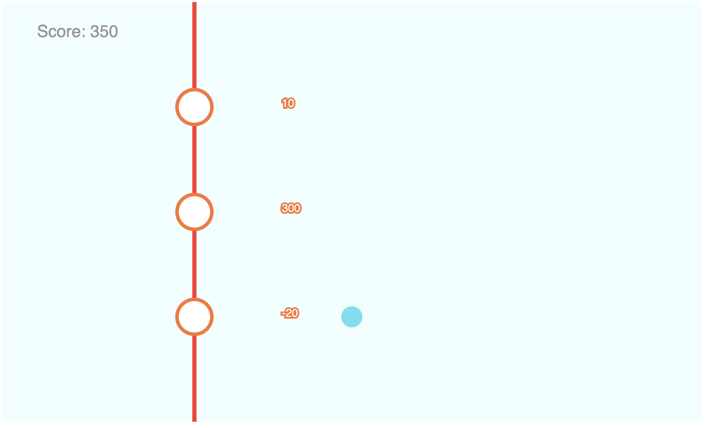

# Binch44

A game like Russian roulette, developed with Andrew Lee during KAIST Startup Hackathon.

# How to run

First, install dependencies:

    pip install

Then, run the server:

    pip run python manage.py runserver
